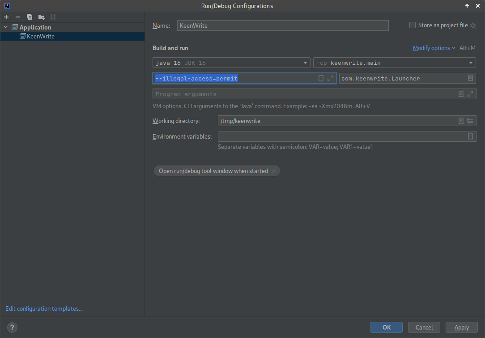

# Introduction

This document describes how to build the application and platform binaries.

# Requirements

Download and install the following software packages:

* [JDK 16](https://bell-sw.com/pages/downloads/?version=java-16) (Full JDK + JavaFX)
* [Gradle 7.0](https://services.gradle.org/distributions)
* [Git 2.28.0](https://git-scm.com/downloads)

## Repository

Clone the repository as follows:

    git clone https://github.com/DaveJarvis/keenwrite.git

The repository is cloned.

# Build

Build the application überjar as follows:

    cd keenwrite
    gradle clean jar

The application is built.

# Run

After the application is compiled, run it as follows:

    java --illegal-access=permit -jar build/libs/keenwrite.jar

On Windows:

    java --illegal-access=permit -jar build\libs\keenwrite.jar

# Integrated development environments

This section describes setup instructions to import and run the application using an integrated development environment (IDE). Running the application should trigger a build.

## IntelliJ IDEA

This section describes how to build and run the application using IntellIJ's IDEA.

### Import

Complete the following steps to import the application:

1. Start the IDE.
1. Click **File → New → Project from Existing Sources**.
1. Browse to the directory containing `keenwrite`.
1. Click **OK**.
1. Select **Gradle** as the external model.
1. Click **Finish**.

The project is imported into the IDE.

### Configure

Configure the IDE to run the application as follows:

1. Click **Run → Edit Configurations**.
1. Click **+** to add a new configuration.
1. Set **Name** to: KeenWrite
1. Click **Modify Options → Add VM options**.
1. Set **VM options** field to: `--illegal-access=permit`
1. Click **OK** close the dialog.

The changes should resemble:

### Run

Click **Run → KeenWrite** to launch the application.

# Installers

This section describes how to set up the development environment and build native executables for supported operating systems.

## Setup

Follow these one-time setup instructions to begin:

1. Ensure `$HOME/bin` is set in the `PATH` environment variable.
1. Copy `build-template` into `$HOME/bin`.

Setup is complete.

## Binaries

Run the `installer` script to build platform-specific binaries, such as:

    ./installer -V -o linux

The `installer` script:

* downloads a JDK;
* generates a run script;
* bundles the JDK, run script, and JAR file; and
* creates a standalone binary, so no installation required.

Run `./installer -h` to see all command-line options.

# Releases

After installing `scripts/build-template`, build release binaries as follows:

    git tag -a 2.0.0 -m "Release name"
    git push origin --tags
    ./release.sh

When finished, browse to the project releases page to draft a new release.

# Versioning

Version numbers are read directly from Git using a plugin. The version number is written to `app.properties` in the `resources` directory. The application reads that file to display version information upon start.

