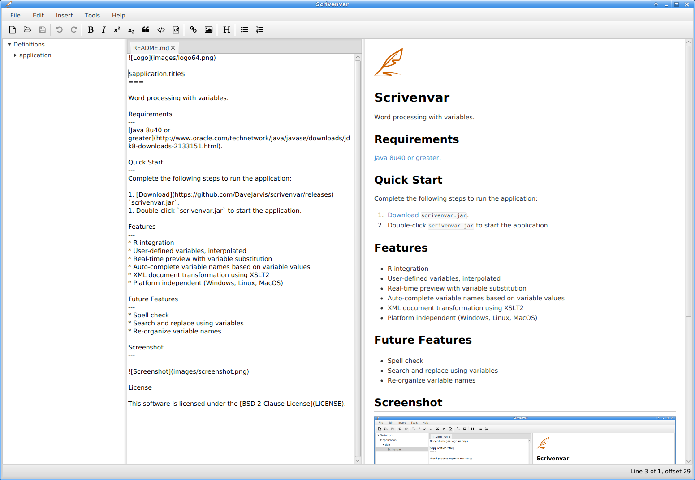

Scrivenvar
===

A word processor with variables.

Requirements
---

Download and install [Java 8u40](http://www.oracle.com/technetwork/java/javase/downloads/jdk8-downloads-2133151.html).

Installation
---

1. [Download](https://github.com/DaveJarvis/scrivenvar/releases) the latest zip archive and extract it to any folder.
1. Double-click `scrivenvar.jar` to start the application.

License
---

This software is licensed under the [BSD 2-Clause License](LICENSE)

   [Markdown]: http://daringfireball.net/projects/markdown
   [commonmark-java]: https://github.com/atlassian/commonmark-java
   [pegdown]: https://github.com/sirthias/pegdown
   [Markdown Extra]: https://michelf.ca/projects/php-markdown/extra
   [MultiMarkdown]: http://fletcherpenney.net/multimarkdown
   [Github-flavoured-Markdown]: https://help.github.com/articles/github-flavored-markdown
   [MigLayout]: https://github.com/mikaelgrev/miglayout
   [RichTextFX]: https://github.com/TomasMikula/RichTextFX
   [ReactFX]: https://github.com/TomasMikula/ReactFX
   [WellBehavedFX]: https://github.com/TomasMikula/WellBehavedFX
   [Flowless]: https://github.com/TomasMikula/Flowless
   [UndoFX]: https://github.com/TomasMikula/UndoFX
   [FontAwesomeFX]: https://bitbucket.org/Jerady/fontawesomefx

