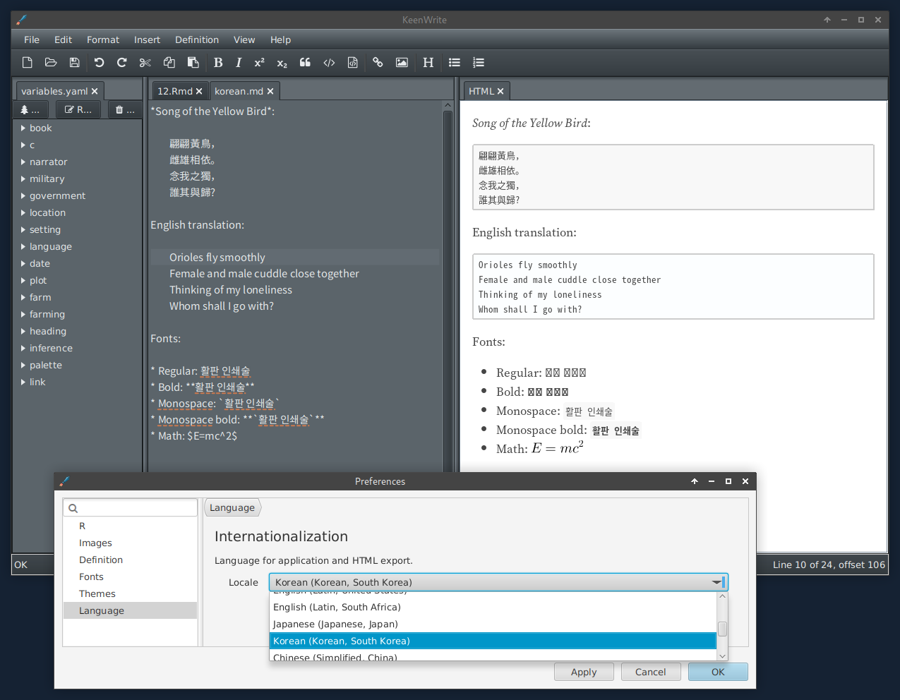
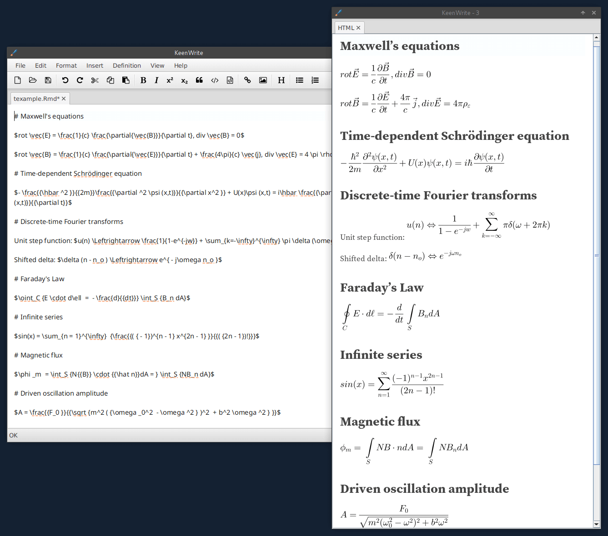
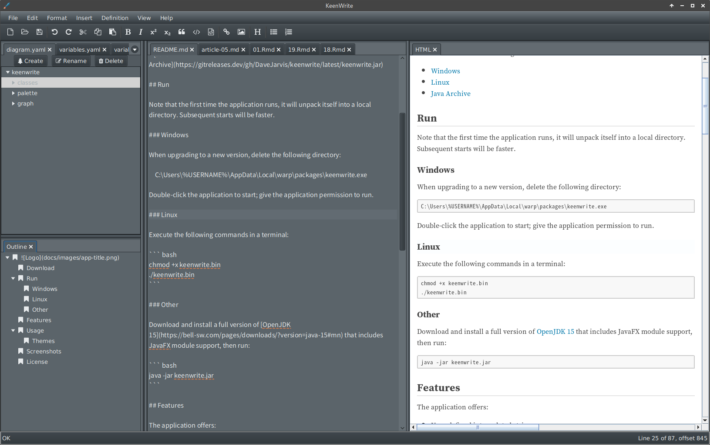

   

# 

A text editor that uses [interpolated strings](https://en.wikipedia.org/wiki/String_interpolation) to reference externally defined values.

## Download

Download one of the following editions:

* [Windows](https://gitreleases.dev/gh/DaveJarvis/keenwrite/latest/keenwrite.exe)
* [Linux](https://gitreleases.dev/gh/DaveJarvis/keenwrite/latest/keenwrite.bin)
* [Java Archive](https://gitreleases.dev/gh/DaveJarvis/keenwrite/latest/keenwrite.jar)

## Run

Note that the first time the application runs, it will unpack itself into a local directory. Subsequent starts will be faster.

### Windows

When upgrading to a new version, delete the following directory:

    C:\Users\%USERNAME%\AppData\Local\warp\packages\keenwrite.exe

Double-click the application to start; give the application permission to run.

### Linux

Execute the following commands in a terminal:

``` bash
chmod +x keenwrite.bin
./keenwrite.bin
```

### Other

Download and install a full version of [OpenJDK 15](https://bell-sw.com/pages/downloads/?version=java-15#mn) that includes JavaFX module support, then run:

``` bash
java -jar keenwrite.jar
```

## Features

The application offers:

* User-defined interpolated strings
* Auto-complete variable names based on variable values
* Real-time spell check
* Real-time rendering of math using TeX notation
* Diagrams: Mermaid, GraphViz, UML, sequence, timing, and [many more](https://kroki.io/)!
* Dark, custom, and responsive themes
* Interactive document outline
* Internationalized font support (e.g., Chinese, Japanese, Korean, etc.)
* R integration
* XML transformation using XSLT3 or older
* Customizable user interface having detachable tabs
* Platform-independent (Windows, Linux, MacOS)

## Usage

Read the [detailed documentation](docs/README.md) for using the application.

### Themes

Read the [themes documentation](docs/themes.md) to learn about themes.

## Screenshots

Diagram that includes variables:


Poem with locale settings:



TeX equations with detached preview:



Document outline opened and docked in bottom-left corner:



## License

This software is licensed under the [BSD 2-Clause License](LICENSE.md) and
based on [Markdown-Writer-FX](licenses/MARKDOWN-WRITER-FX.md).

