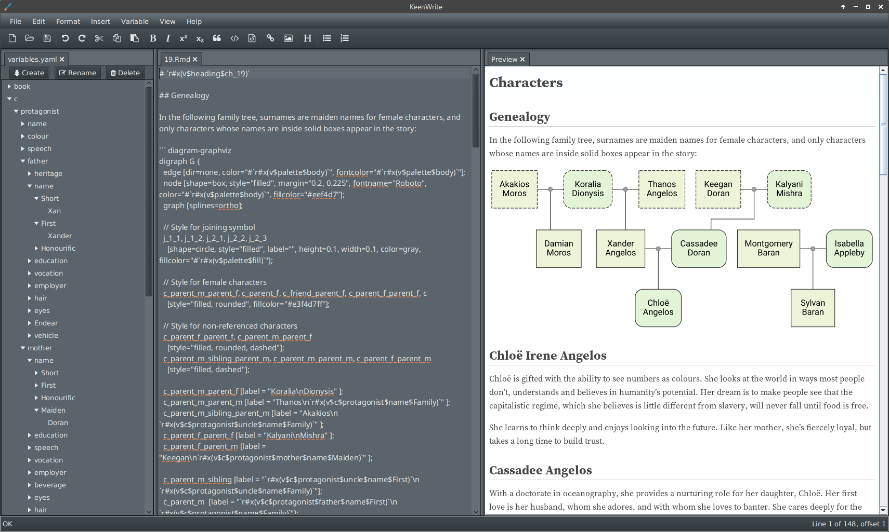
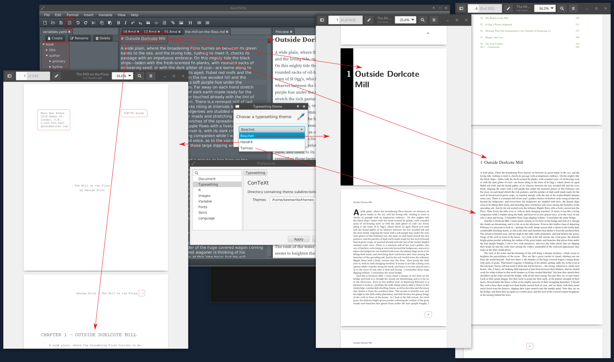

# Variables

Diagrams that include variables:

# PDF themes

In the background of the following screenshot, the editor shows a novel
being edited:

Highlighted items of note:

* PDF icon in the upper-left
* Novel metadata as integrated variables towards the top-left
* Theme selection dialog in the upper-middle
* Three different styles, including:
    * Boschet, based on Baskerville font, nicely styled
    * Handrit, based on Courier font, double-spaced, manuscript format
    * Tarmes, based on Times Roman font, minimal styling
* Variations in page numbers
* Manuscript includes word count, automatically
* Preferences dialog in the middle

# Internationalization

Poem with locale settings:

# Equations

TeX equations with detached preview:

# Dockable tabs

Document outline opened and docked in bottom-left corner:

