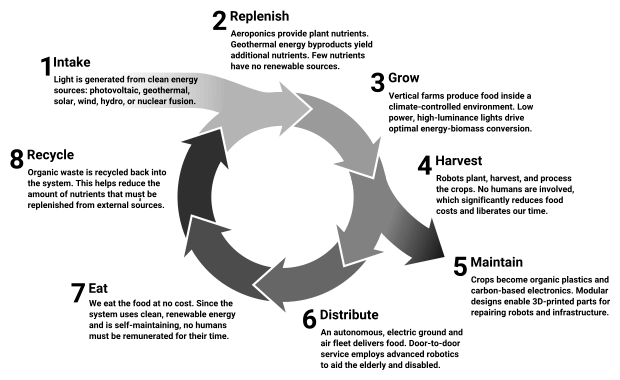
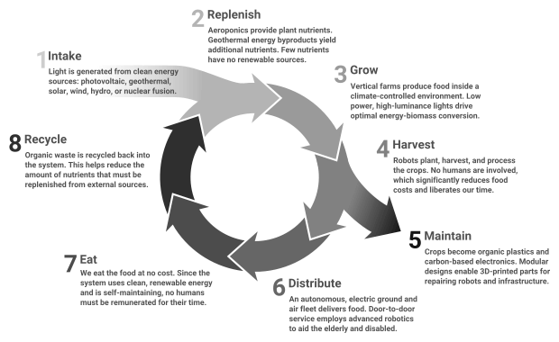

# Introduction

The Scalable Vector Graphics (SVG) drawing software---[Batik](https://xmlgraphics.apache.org/batik/)---that's used by the application may be unable to read certain SVG files produced by [Inkscape](https://inkscape.org/). The result is that embedding the vector graphics files may trigger the following issues:

* Unable to create nested element
* Black blocks, no text displayed
* Black text instead of coloured

The remainder of this document explains these problems and how to fix them.

# Nested element

When referencing a vector graphic using Markdown, the status bar may show the following error:

> The current document is unable to create an element of the requested type (namespace: http://www.w3.org/2000/svg, name: flowRoot).

This error is due to a version mismatch of the `flowRoot` element that Inkscape creates.

## Fix

Resolve the issue by changing the SVG version number as follows:

1. Edit the vector graphics file using any text editor.
1. Find `version="1.1"` and change it to `version="1.2"`.
1. Save the file.

The SVG will now appear inside the application; however, the text may appear as black blocks.

# Black blocks

Depending on how text is added to a vector graphic in Inkscape, the text may be inserted within an element called a `flowRoot`. Although Batik recognizes `flowRoot` for SVG version 1.2, it cannot fully interpret the contents. Black blocks are drawn instead of the text, such as those depicted in the following figure:

## Fix

Resolve the issue by "unflowing" all text elements as follows:

1. Start Inkscape.
1. Load the SVG file.
1. Select all the text elements.
1. Click **Text → Unflow**.

The text may change size and position; recreate the text without dragging using the text tool. After all the text areas have been recreated, continue as follows:

1. Click **Edit → XML Editor**.
1. Expand the **XML Editor** to see more elements.
1. Delete all elements named `svg:flowRoot`.
1. Save the file.

When the illustration is reloaded, the black blocks will have disappeared, but the text elements ignore any assigned colour.

# Black text

When an SVG `style` attribute contains a reference to `-inkscape-font-specification`, Batik ignores all values that follow said reference. This results in black text, such as:

## Fix

Resolve the issue of colourless text as follows:

1. Open the SVG file in a plain text editor.
1. Remove all references `-inkscape-font-specification:'';`, including the trailing (or leading) semicolon.
1. Save the file.

When the illustration is reloaded, the colours will have reappeared, such as:

